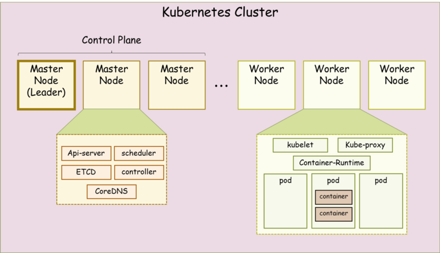

# minikube를 활용한 spring 배포 및 외부 환경 연동 구축

---

## 팀원

| 이름   | 이제현 | 김동민 | 김현수 | 신준수 | 이정이 | 홍혜원 |
|--------|--------|--------|--------|--------|--------|--------|
| 프로필 |  |  |  |  |  |  |
| GitHub | [lyjh98](https://github.com/lyjh98) | [kddmmm](https://github.com/kddmmm) | [Hyunsoo1998](https://github.com/Hyunsoo1998) | [shinjunsuuu](https://github.com/shinjunsuuu) | [2jeong2](https://github.com/2jeong2) | [hyewon8245](https://github.com/hyewon8245) |


## 프로젝트 목적

- 로컬에서 **외부 연동까지 검증 가능한 최소 배포 흐름**을 확인하기 위해, Spring 앱을 배포하고 Service(NodePort)/`port-forward`로 접근 경로를 구성함.
- 배포·접근이 실제로 동작함을 확인하기 위해, 윈도우에서 postman을 활용하여 엔드포인트 응답을 검증함.

## 개념

- 쿠버네티스
    
    🧩 Kubernetes 기본 구조
    
    
    
    - **Pod**
        
        컨테이너가 실행되는 가장 작은 단위로, 하나 이상의 컨테이너와 스토리지, 네트워크를 포함함.
        
        애플리케이션이 실제로 동작하는 공간, 쿠버네티스 관리의 기본 단위.
        
    - **Deployment**
        
        원하는 수의 Pod를 유지하고 자동으로 생성·삭제, 롤링 업데이트와 롤백을 지원함.
        
        애플리케이션의 무중단 배포와 안정적인 운영을 보장하는 컨트롤러.
        
    - **Service**
        
        변하는 Pod의 IP 대신 고정된 접근점을 제공해 클러스터 내부 또는 외부 트래픽을 연결함.
        
        로드밸런싱 기능을 통해 여러 Pod에 트래픽을 분산시켜 안정적인 서비스를 유지하는 역할 .
        
    - **Cluster**
        
        여러 노드(마스터와 워커)가 모여 하나의 시스템처럼 동작하는 쿠버네티스의 기본 환경.
        
        리소스 스케줄링과 관리 기능을 제공해 애플리케이션을 확장 가능하게 운영할 수 있음.
        
- Kubernetes **vs** Minikube
    - **Kubernetes(K8s)**
        
        실제 운영 환경에서 사용하는 컨테이너 오케스트레이션 플랫폼으로, 다수의 노드로 구성된 클러스터를 관리함.
        
        확장성·고가용성·자동화된 배포를 지원하며, 대규모 애플리케이션 운영에 최적화되어 있음.
        
    - **Minikube**
        
        로컬 환경에서 Kubernetes를 가볍게 실행할 수 있도록 만든 학습·테스트용 도구.
        
        단일 노드 클러스터를 제공하며, 설치와 실행이 간단해 개발 및 테스트에 적합함.
        

## 환경세팅

- 우분투 24.04에서 진행
- kubectl 버전
- minikube 사용 v1.37.0
- docker & kubectl & minikube 설치 과정
    1. docker 설치
        
        ```bash
        **$ sudo apt update
        
        #1. docker 설치
        $ sudo apt install -y docker.io
        
        # 현재 접속 확인
        $ who
        
        # 권한 추가 및 적용
        $ sudo usermod -aG docker $USER
        $ negrp docker
        $ group
        
        #swap 메모리 비활성화
        free -h**
        ```
        
    2. Minikube 설치 & kubectl 설치
        
        ```bash
        # Minikube 최신 버전 설치 및 다운로드한 바이너리 삭제 
        **curl -LO https://storage.googleapis.com/minikube/releases/latest/minikube-linux-amd64
        
        sudo install minikube-linux-amd64 /usr/local/bin/minikube && rm minikube-linux-amd64
        
        minikube version
        
        # kubectl 미존재할 경우만 설치 
        curl -LO "https://dl.k8s.io/release/$(curl -L -s https://dl.k8s.io/release/stable.txt)/bin/linux/amd64/kubectl"
        
        sudo install -o root -g root -m 0755 kubectl /usr/local/bin/kubectl**
        
        # kubectl 버전 확인 
        **kubectl version --output=yaml
        
        kubectl version**
        
        ```
        

## 과정1 (DAY1)

### 아키텍처


---

1. Minikube 클러스터 생성
    
    ```bash
    $ minikube start 
    
    $ minikube status
    
    $ kubectl get all
    
    **# 클러스터와 상호 작용(cluster에 access)
    kubectl get po -A**
    ```
    
2. test.yaml
    
    ```yaml
    apiVersion: apps/v1
    kind: Deployment
    metadata:
      name: spring-deployment
    spec:
      replicas: 3
      selector:
        matchLabels:
          app: spring
      template:
        metadata:
          labels:
            app: spring
        spec:
          containers:
          - name: spring
            image: hyewon8245/springapp-hyewon:1.0
            ports:
            - containerPort: 8080
    
    ---
    apiVersion: v1
    kind: Service
    metadata:
      name: spring-service
    spec:
      selector:
        app: spring
      ports:
        - protocol: TCP
          port: 7080
          targetPort: 8080
          nodePort: 30080  # 30000~32767 사이의 값 선택 가능
      type: NodePort
    ```
    
    `kubectl apply -f test.yaml`
    
3. 외부 접근 설정
    
    ```bash
    **$ kubectl port-forward --address 0.0.0.0 svc/spring-service 30080:7080
    $ kubectl get services**
    ```
    
4. 접속 테스트
    
    ```bash
    **$ curl http://192.168.49.2:30080/app/get**
    ```
    

## 결과


## 회고

- **클러스터–서비스–파드 구조 이해 향상**
    
    Deployment → Pod → Service로 이어지는 라우팅 흐름을 손으로 배포·요청해 보며 체감함. 레이블/셀렉터가 느슨하면 트래픽이 엉뚱한 파드로 갈 수 있음을 배움.
    
- **이미지 Pull/네트워크 이슈로 시행착오**
    
    프라이빗/퍼블릭 레지스트리 인증, 태그 오타, 이미지 캐시 등으로 Pull 에러를 겪음. 또한 NodePort, 포트포워딩, Ingress 간 역할 차이를 정리하며 **쿠버네티스 네트워크 계층**(Pod IP / ClusterIP / Node IP / Ingress 경로)에 대한 이해가 깊어짐.
