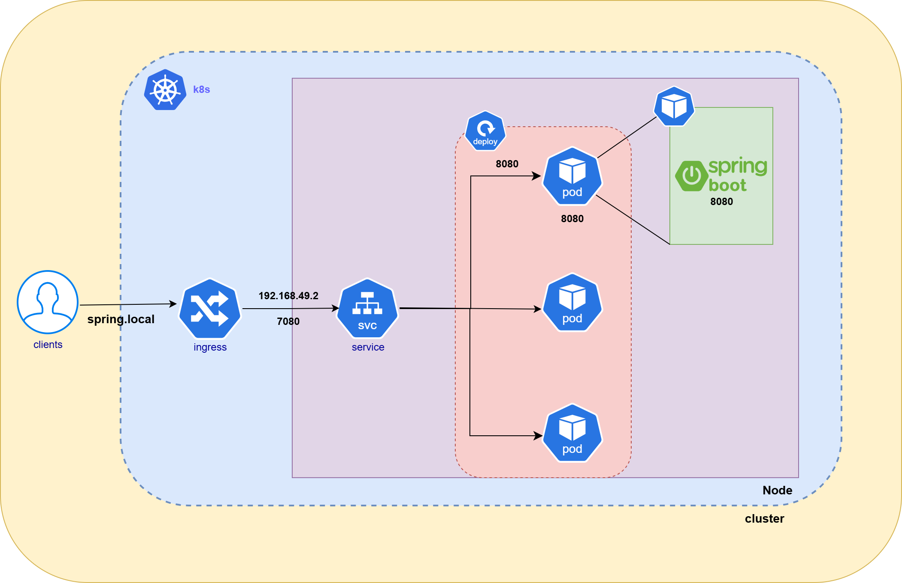

# minikube를 활용한 spring 배포 및 ingress를 통한 도메인 접속 환경 구축

## 팀원

| 이름 | 이제현 | 김동민 | 김현수 | 신준수 | 이정이 | 홍혜원 |
| --- | --- | --- | --- | --- | --- | --- |
| 프로필 |  |  |  |  |  |  |
| GitHub | [lyjh98](https://github.com/lyjh98) | [kddmmm](https://github.com/kddmmm) | [Hyunsoo1998](https://github.com/Hyunsoo1998) | [shinjunsuuu](https://github.com/shinjunsuuu) | [2jeong2](https://github.com/2jeong2) | [hyewon8245](https://github.com/hyewon8245) |

## 프로젝트 목적

- 로컬 Minikube에 배포된 Spring 앱을 **Ingress로 노출**하여, 내부 우분투 환경에서 **도메인으로 접근** 가능한 실행 경로를 마련한다.
- Ingress 라우팅과 도메인 매핑이 정상임을 **`curl`로 응답 검증**해 배포·접근 흐름을 확인한다.


## Ingress

- Ingress는 **클러스터 외부 요청을 내부 서비스로 라우팅**하는 역할을 하는 쿠버네티스 리소스.
- NodePort나 LoadBalancer와 달리 **하나의 진입점**을 통해 여러 서비스를 관리할 수 있음 .

## 환경세팅

- 우분투 24.04에서 진행
- kubectl 버전
- minikube 사용 v1.37.0
- docker & kubectl & minikube 설치 과정
    1. docker 설치
        
        ```bash
        **$ sudo apt update
        
        #1. docker 설치
        $ sudo apt install -y docker.io
        
        # 현재 접속 확인
        $ who
        
        # 권한 추가 및 적용
        $ sudo usermod -aG docker $USER
        $ negrp docker
        $ group
        
        #swap 메모리 비활성화
        free -h**
        ```
        
    2. Minikube 설치 & kubectl 설치
        
        ```bash
        # Minikube 최신 버전 설치 및 다운로드한 바이너리 삭제 
        **curl -LO https://storage.googleapis.com/minikube/releases/latest/minikube-linux-amd64
        
        sudo install minikube-linux-amd64 /usr/local/bin/minikube && rm minikube-linux-amd64
        
        minikube version
        
        # kubectl 미존재할 경우만 설치 
        curl -LO "https://dl.k8s.io/release/$(curl -L -s https://dl.k8s.io/release/stable.txt)/bin/linux/amd64/kubectl"
        
        sudo install -o root -g root -m 0755 kubectl /usr/local/bin/kubectl**
        
        # kubectl 버전 확인 
        **kubectl version --output=yaml
        
        kubectl version**
        
        ```
        

## 과정2 (DAY2)

### 아키텍처



test.yaml

```yaml
apiVersion: apps/v1
kind: Deployment
metadata:
  name: spring-deployment
spec:
  replicas: 3
  selector:
    matchLabels:
      app: spring
  template:
    metadata:
      labels:
        app: spring
    spec:
      containers:
      - name: spring
        image: hyewon8245/springapp-hyewon:1.0
        ports:
        - containerPort: 8080

---
apiVersion: v1
kind: Service
metadata:
  name: spring-service
spec:
  selector:
    app: spring
  ports:
    - protocol: TCP
      port: 7080
      targetPort: 8080
      nodePort: 30080  # 30000~32767 사이의 값 선택 가능
  type: NodePort
```

test-ingress.yaml

```yaml
apiVersion: networking.k8s.io/v1
kind: Ingress
metadata:
  name: spring-ingress
  namespace: default  
  annotations:
    nginx.ingress.kubernetes.io/rewrite-target: /
spec:
  rules:
  - host: spring.local
    http:
      paths:
      - path: /
        pathType: Prefix
        backend:
          service:
            name: spring-service
            port:
              number: 7080
```

## 적용 결과


## 회고

- 선언형 YAML 파일을 통해 Deployment, Service, Ingress까지 구성해 보았다.
    
    처음에는 Pod와 Service만으로도 충분하다고 생각했지만, Ingress를 적용하면서 도메인 기반 라우팅과 외부 접근을 효율적으로 제어할 수 있다는 점을 배웠다.
    
    특히 `kubectl apply -f`로 관리할 수 있어 재현성과 협업 측면에서 장점이 크다는 것을 체감했다.
